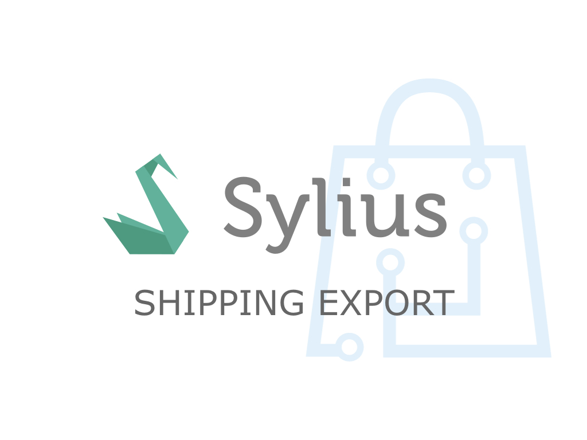

<h1 align="center">
    <a href="http://bitbag.shop" target="_blank">
        
    </a>
    <br />
    <a href="https://packagist.org/packages/bitbag/shipping-export-plugin" title="License" target="_blank">
        
    </a>
    <a href="https://packagist.org/packages/bitbag/shipping-export-plugin" title="Version" target="_blank">
        
    </a>
    <a href="http://travis-ci.org/BitBagCommerce/SyliusShippingExportPlugin" title="Build status" target="_blank">
            
        </a>
    <a href="https://scrutinizer-ci.com/g/BitBagCommerce/SyliusShippingExportPlugin/" title="Scrutinizer" target="_blank">
        
    </a>
    <a href="https://packagist.org/packages/bitbag/shipping-export-plugin" title="Total Downloads" target="_blank">
        
    </a>
    <p>
        
    </p>
</h1>

## BitBag SyliusShippingExportPlugin

Managing shipments in any eCommerce app is something that may be tricky. There are many shipping providers and
each has its own API format you might want to use to export shipping data and request the pickup. To make this process more simple and generic, we decided to create an abstract layer for Sylius platform based applications for this purpose. This plugin allows you to write simple API calls and configuration form for
specific shipping provider. The workflow is quite simple - configure a proper data that's needed to export a shipment, like access key or pickup hour,
book a courier for an order with one click and get shipping label file if any was received from the API.
The implementation limits to writing a shipping provider gateway configuration form, one event listener and webservice access layer.

If you are curious about the details of this plugin, read [this blog post](https://bitbag.shop/blog/bitbag-shipping-export-plugin-simple-way-to-control-shipments-in-your-online-store).

## Support

You can order our support on [this page](https://bitbag.shop/products/sylius-mailchimp).

We work on amazing eCommerce projects on top of Sylius and other great Symfony based solutions, like eZ Platform, Akeneo or Pimcore.
Need some help or additional resources for a project? Write us an email on mikolaj.krol@bitbag.pl or visit
[our website](https://bitbag.shop/)! :rocket:

## Demo

We created a demo app with some useful use-cases of the plugin! Visit [demo.bitbag.shop](https://demo.bitbag.shop/en_US/products-list/t-shirts) to take a look at it.
The admin can be accessed under [demo.bitbag.shop/admin](https://demo.bitbag.shop/admin) link and `sylius: sylius` credentials.

## Installation

If you use Sylius 1.4, you might get a compatibility issue for Pagerfanta. Please read [this issue](https://github.com/BitBagCommerce/SyliusShippingExportPlugin/issues/23) in order to proceed with a workaround.

```bash
$ composer require bitbag/shipping-export-plugin
```


Add plugin dependencies to your `config/bundles.php` file:
```php
return [
    ...

    BitBag\SyliusShippingExportPlugin\BitBagSyliusShippingExportPlugin::class => ['all' => true],
];
```

Import required config in your `config/packages/_sylius.yaml` file:
```yaml
# config/packages/_sylius.yaml

imports:
    ...

    - { resource: "@BitBagSyliusShippingExportPlugin/Resources/config/config.yml" }
```

Import routing **on top** of your `config/routes.yaml` file:
```yaml
# config/routes.yaml

bitbag_sylius_shipping_export_plugin:
    resource: "@BitBagSyliusShippingExportPlugin/Resources/config/routing.yml"
```

## Usage

### Adding shipping export configuration form

```php
namespace App\Form\Type;

use Symfony\Component\Form\AbstractType;
use Symfony\Component\Form\Extension\Core\Type\TextType;
use Symfony\Component\Form\FormBuilderInterface;
use Symfony\Component\Validator\Constraints\NotBlank;

final class FrankMartinShippingGatewayType extends AbstractType
{
    public function buildForm(FormBuilderInterface $builder, array $options): void
    {
        $builder
            ->add('iban', TextType::class, [
                'label' => 'IBAN',
                'constraints' => [
                    new NotBlank([
                        'message' => 'IBAN number cannot be blank.',
                        'groups' => 'bitbag',
                    ])
                ],
            ])
            ->add('address', TextType::class, [
                'label' => 'Address',
                'constraints' => [
                    new NotBlank([
                        'message' => 'Address cannot be blank.',
                        'groups' => 'bitbag',
                    ])
                ],
            ])
        ;
    }
}
```

#### Service definition
```yaml
services:
    app.form.type.frank_martin_shipping_gateway:
        class: App\Form\Type\FrankMartinShippingGatewayType
        tags:
            - { name: bitbag.shipping_gateway_configuration_type, type: "frank_martin_shipping_gateway", label: "Transporter Gateway" }
```

### Adding shipping export event listener
```php
namespace App\EventListener;

use BitBag\ShippingExportPlugin\Event\ExportShipmentEvent;

final class FrankMartinShippingExportEventListener
{
    public function exportShipment(ExportShipmentEvent $event): void
    {
        $shippingExport = $event->getShippingExport();
        $shippingGateway = $shippingExport->getShippingGateway();

        if ('frank_martin_shipping_gateway' !== $shippingGateway->getCode()) {
            return;
        }

        if (false) {
            $event->addErrorFlash(); // Add an error notification

            return;
        }

        $event->addSuccessFlash(); // Add success notification
        $event->saveShippingLabel("Some label content received from external API", 'pdf'); // Save label
        $event->exportShipment(); // Mark shipment as "Exported"
    }
}
```

#### Service definition
```yaml
services:
    app.event_listener.frank_martin_shipping_export:
        class: App\EventListener\FrankMartinShippingExportEventListener
        tags:
            - { name: kernel.event_listener, event: 'bitbag.export_shipment', method: exportShipment }
```

#### Plugin parameters
```yaml
parameters:
    bitbag.shipping_gateway.validation_groups: ['bitbag']
    bitbag.shipping_labels_path: '%kernel.root_dir%/../shipping_labels'
```

### Available services you can [decorate](https://symfony.com/doc/current/service_container/service_decoration.html) and forms you can [extend](http://symfony.com/doc/current/form/create_form_type_extension.html)
```bash
$ bin/console debug:container | grep bitbag
```

### Parameters you can override in your parameters.yml(.dist) file
```bash
$ bin/console debug:container --parameters | grep bitbag
```

## Testing
```bash
$ composer install
$ cd tests/Application
$ yarn install
$ yarn run gulp
$ bin/console assets:install public -e test
$ bin/console doctrine:schema:create -e test
$ bin/console server:run 127.0.0.1:8080 -d public -e test
$ shipping-export
$ open http://localhost:8080
$ vendor/bin/behat
$ vendor/bin/phpspec run
```

## Contribution

Learn more about our contribution workflow on http://docs.sylius.org/en/latest/contributing/.
