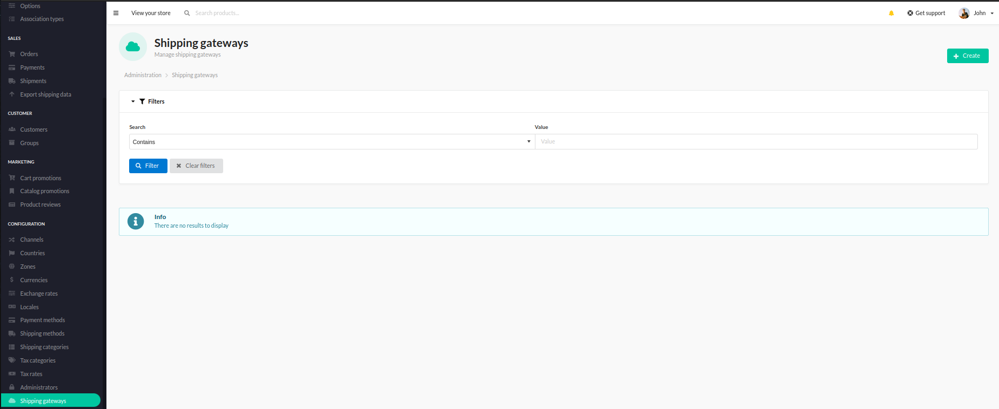
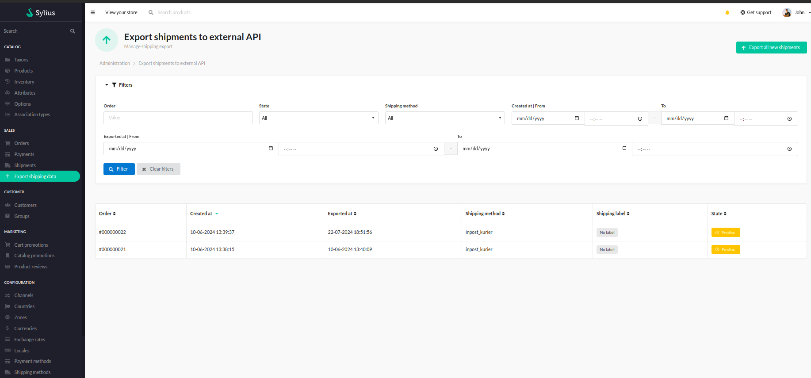

# Functionalities

---

There are many shipping providers and each has its own API format you might want to use to export shipping data and request the pickup. 
This plugin allows you to write simple API calls and configuration form for specific shipping provider. 

After installation, user is now able to create gateway for a specific shipping provider (of course the right configuration form must be firstly written). 

    

Once the shipping method and shipping gateway for the shipping provider are created, customer can use this shipping method during a checkout. 
When the order is placed, user can now go to the 'Export shipping data' section from Sylius Admin Panel and export chosen shipments.

    

